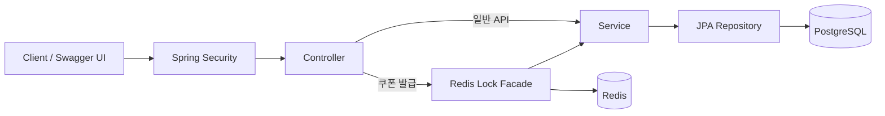
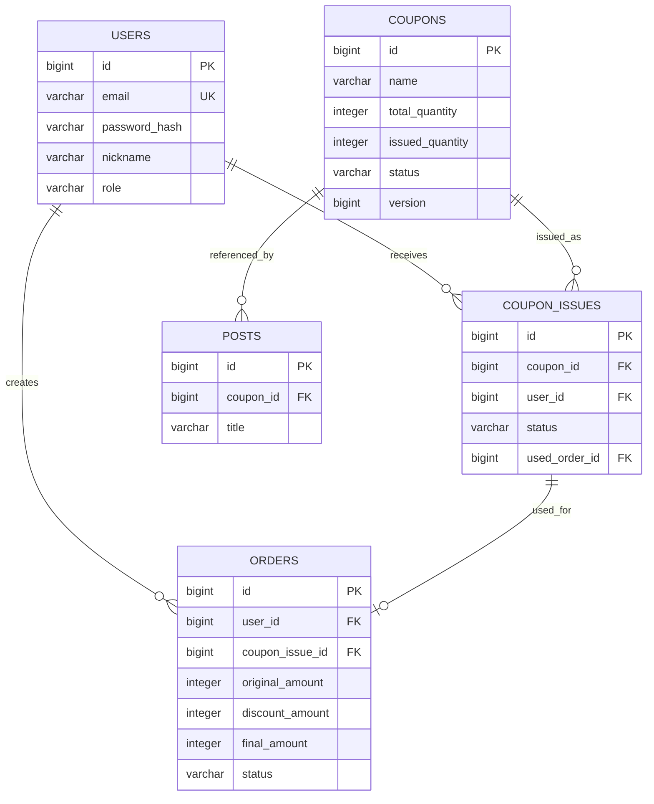
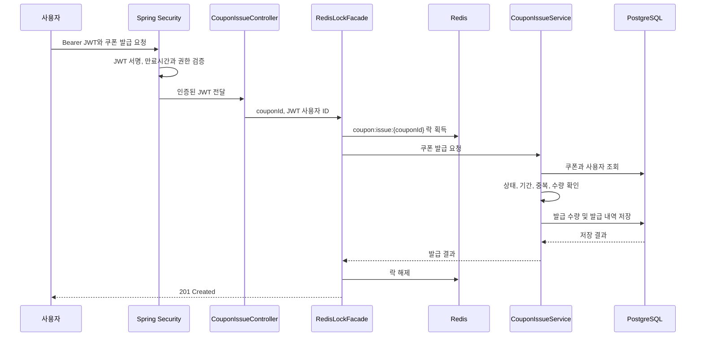

# Coupon Rush

## 프로젝트 소개

Coupon Rush는 한정된 수량의 쿠폰을 생성하고 여러 사용자가 발급받아 주문에 사용하는 과정을 구현한 Spring Boot 백엔드 학습 프로젝트입니다.

단계별 구현 가이드를 참고해 코드를 직접 작성하고 테스트하면서 JPA, 트랜잭션, Spring Security와 동시성 제어의 동작을 익히는 데 목적을 두었습니다. 실제 운영 서비스의 트래픽을 해결한 사례가 아니라, 동시 요청에서 발생할 수 있는 문제와 여러 해결 방법을 코드로 재현하고 비교한 프로젝트입니다.

## 개발 목적

- Controller, Service, Repository의 역할을 구분해 REST API 흐름을 익힘
- JPA 엔티티와 PostgreSQL 스키마의 관계를 이해함
- Flyway로 데이터베이스 변경 이력을 관리함
- JWT 인증과 역할 기반 접근 제어를 구현함
- 낙관적 락, 비관적 락과 Redis 분산 락의 차이를 코드로 확인함
- Testcontainers를 이용해 실제 PostgreSQL과 Redis 기반 통합 테스트를 작성함

## 기술 스택

| 구분 | 기술 |
| --- | --- |
| Language | Java 21 |
| Framework | Spring Boot 3.5, Spring MVC |
| Data | Spring Data JPA, PostgreSQL 16, Flyway |
| Security | Spring Security, OAuth2 Resource Server, JWT, BCrypt |
| Distributed Lock | Redis 7, Redisson |
| API Documentation | springdoc-openapi, Swagger UI |
| Test | JUnit 5, AssertJ, Spring Boot Test, Testcontainers |
| Build | Gradle |

## 시스템 구성



일반 API는 Controller가 Service를 호출합니다. 쿠폰 발급 API는 Redis 락을 담당하는 `CouponIssueRedisLockFacade`를 먼저 거친 뒤 `CouponIssueService`를 호출합니다.

## 주요 기능

### 사용자 및 인증

- 이메일, 닉네임과 비밀번호로 사용자를 생성함
- 비밀번호는 BCrypt 해시로 변환해 저장함
- 로그인 성공 시 JWT Access Token을 발급함
- JWT에 저장된 사용자 ID와 역할을 인증 및 권한 검사에 사용함

### 쿠폰

- 쿠폰의 할인 금액, 전체 수량과 발급 기간을 등록함
- 쿠폰 목록과 상세 정보를 조회함
- 쿠폰 상태, 발급 기간, 남은 수량과 중복 발급 여부를 확인함
- 동일 사용자의 쿠폰 중복 발급을 DB 유일 제약조건으로도 방지함

### 주문

- 로그인한 사용자가 자신에게 발급된 쿠폰으로 주문을 생성함
- 주문 금액에서 쿠폰 할인 금액을 차감함
- 주문 생성과 쿠폰 사용 상태 변경을 하나의 트랜잭션에서 처리함
- 하나의 발급 쿠폰이 여러 주문에 사용되지 않도록 방지함

## 패키지 구조

```text
src/main/java/dev/portfolio/couponrush
├── common
│   ├── config       # Security, Swagger, Redisson 설정
│   ├── exception    # 공통 예외 코드와 응답 처리
│   └── security     # JWT 생성, 검증과 인증 실패 처리
└── domain
    ├── auth         # 로그인과 토큰 발급
    ├── coupon       # 쿠폰 생성, 조회와 발급
    ├── order        # 쿠폰을 사용한 주문 생성
    ├── post         # 게시글 엔티티와 저장소
    └── user         # 사용자 생성과 조회
```

도메인 내부는 기능에 따라 `controller`, `service`, `repository`, `entity`, `dto` 패키지로 나누었습니다. `post` 도메인은 현재 엔티티와 Repository까지만 구현되어 있습니다.

## 데이터베이스 구조



스키마는 Flyway 마이그레이션으로 관리합니다. Hibernate의 `ddl-auto=validate`는 애플리케이션 시작 시 엔티티와 실제 스키마가 일치하는지 확인하는 용도로만 사용합니다.

## 쿠폰 발급 처리 흐름



트랜잭션은 Redis 락을 획득한 뒤 `CouponIssueService`에서 시작됩니다. 서비스 처리가 완료되거나 예외로 종료된 다음 현재 요청이 소유한 락을 해제합니다.

## 동시성 문제

쿠폰 재고가 1개 남았을 때 요청 A와 요청 B가 동시에 같은 `issuedQuantity`를 조회하면 두 요청이 모두 발급 가능하다고 판단할 수 있습니다. 단순 조회와 수정만으로는 초과 발급 또는 수정 충돌이 발생할 수 있으므로 동시성 제어가 필요합니다.

이 프로젝트에서는 같은 문제에 낙관적 락, 비관적 락과 Redis 분산 락을 차례로 적용하며 동작을 확인했습니다.

### 낙관적 락

`Coupon`의 `@Version` 값을 UPDATE 조건에 포함해 조회 이후 다른 트랜잭션이 데이터를 변경했는지 확인합니다.

- 데이터를 조회할 때 DB 행을 잠그지 않음
- 먼저 저장된 요청이 version을 변경함
- 같은 version으로 저장하려는 나머지 요청은 충돌 예외가 발생함
- 충돌이 적은 환경에 적합하지만 재시도 정책이 필요할 수 있음

동시성 테스트에서는 재고보다 많이 발급되지는 않았지만, 충돌한 요청이 실패하므로 항상 재고 수량만큼 성공하지는 않는다는 점을 확인했습니다.

### 비관적 락

JPA의 `PESSIMISTIC_WRITE`를 사용해 쿠폰을 조회할 때 DB 행에 쓰기 락을 획득합니다.

- 한 요청이 처리되는 동안 다른 요청은 같은 쿠폰 행의 락을 기다림
- 트랜잭션이 끝날 때 락이 해제됨
- 요청을 순차 처리하기 쉽지만 DB 연결과 락 대기가 길어질 수 있음

비관적 락은 별도의 학습 브랜치에서 Repository 조회 방식과 Service 호출을 변경해 동작을 확인했습니다.

### Redis 분산 락

Redisson의 `RLock`을 이용해 `coupon:issue:{couponId}` 형식의 쿠폰별 락을 생성합니다.

- 같은 쿠폰의 요청은 동일한 Redis 락을 사용함
- 서로 다른 쿠폰의 요청은 별개의 락으로 처리됨
- 여러 서버가 하나의 Redis를 사용하면 같은 락을 공유할 수 있음
- Redis 장애와 락 대기시간을 별도로 고려해야 함

현재 쿠폰 발급 API에는 Redis 분산 락을 적용했습니다. `@Version`, 중복 발급 유일 제약조건과 수량 체크 제약조건은 DB의 추가 방어선으로 유지합니다.

### 방식별 비교

| 방식 | 충돌 처리 | 장점 | 고려할 점 |
| --- | --- | --- | --- |
| 낙관적 락 | 저장 시 version 충돌을 감지함 | DB 행을 미리 잠그지 않음 | 충돌 시 실패 또는 재시도가 필요함 |
| 비관적 락 | DB 행을 선점하고 대기시킴 | 처리 순서가 명확함 | DB 락과 연결 대기가 증가할 수 있음 |
| Redis 분산 락 | Redis의 공통 락으로 대기시킴 | 여러 서버가 같은 락을 공유할 수 있음 | Redis 운영과 장애 대응이 필요함 |

아직 실제 부하 환경에서 세 방식의 성능을 측정하지 않았으므로 특정 방식이 항상 더 빠르다고 결론 내리지 않았습니다.

## 인증 및 인가

Spring Security OAuth2 Resource Server가 `Authorization: Bearer {token}` 헤더의 JWT를 검증합니다.

- JWT `subject`: 사용자 ID
- JWT `role`: `USER` 또는 `ADMIN`
- 공개 API: 회원가입, 로그인, 쿠폰 조회
- `ADMIN`: 쿠폰 생성
- `USER`, `ADMIN`: 쿠폰 발급과 주문 생성
- 인증 실패: `401 Unauthorized`
- 권한 부족: `403 Forbidden`

현재는 Access Token만 제공하며 Refresh Token, 로그아웃과 토큰 폐기 기능은 구현하지 않았습니다.

## 테스트 전략

학습 과정에서 Repository, Service, Controller 계층의 동작을 각각 확인하고, 실제 데이터베이스 기능이 필요한 테스트에는 Testcontainers를 사용했습니다.

| 테스트 범위 | 확인 내용 |
| --- | --- |
| Repository | 엔티티 저장, 기본값, 유일 제약조건과 외래 키 |
| Service | 정상 처리, 비즈니스 규칙과 트랜잭션 롤백 |
| Controller | 요청 검증, HTTP 상태 코드, JWT 인증과 역할별 권한 |
| JWT | 토큰 생성, 클레임, 서명과 만료시간 검증 |
| 동시성 | 낙관적 락 충돌과 최종 데이터 정합성 |
| Redis 락 | 20개 동시 요청에서 재고 5개만 발급되는지 검증 |

전체 테스트는 다음 명령으로 실행합니다. Testcontainers를 사용하므로 Docker가 실행 중이어야 합니다.

```bash
JWT_SECRET="$(openssl rand -base64 32)" ./gradlew test --rerun-tasks
```

## API 문서

| Method | Endpoint | 기능 | 접근 권한 |
| --- | --- | --- | --- |
| `POST` | `/api/users` | 사용자 생성 | 공개 |
| `POST` | `/api/auth/login` | 로그인 및 JWT 발급 | 공개 |
| `GET` | `/api/users/{userId}` | 사용자 단건 조회 | 인증 필요 |
| `POST` | `/api/coupons` | 쿠폰 생성 | `ADMIN` |
| `GET` | `/api/coupons` | 쿠폰 목록 조회 | 공개 |
| `GET` | `/api/coupons/{couponId}` | 쿠폰 단건 조회 | 공개 |
| `POST` | `/api/coupons/{couponId}/issues` | 쿠폰 발급 | `USER`, `ADMIN` |
| `POST` | `/api/orders` | 발급 쿠폰을 사용한 주문 생성 | `USER`, `ADMIN` |

애플리케이션 실행 후 Swagger에서 상세 요청 및 응답 형식을 확인할 수 있습니다.

- Swagger UI: <http://localhost:8080/swagger-ui/index.html>
- OpenAPI JSON: <http://localhost:8080/v3/api-docs>

## 실행 방법

### 사전 준비

- JDK 21
- Docker 및 Docker Compose

### 1. 저장소 복제

```bash
git clone https://github.com/seo-ju-yeon/coupon-rush.git
cd coupon-rush
```

### 2. PostgreSQL과 Redis 실행

```bash
docker compose up -d
docker compose ps
```

### 3. JWT 비밀 키 설정

HS256 서명에 사용할 32바이트 이상의 값을 Base64 문자열로 생성합니다.

```bash
export JWT_SECRET="$(openssl rand -base64 32)"
```

IntelliJ IDEA에서 실행한다면 `실행 > 구성 편집 > CouponRushApplication > 환경 변수`에 `JWT_SECRET`을 등록합니다.

### 4. 애플리케이션 실행

```bash
./gradlew bootRun
```

Flyway가 마이그레이션을 적용한 뒤 Hibernate가 엔티티와 데이터베이스 스키마의 일치 여부를 확인합니다.

### 5. 종료

```bash
docker compose down
```

PostgreSQL 데이터까지 삭제하려면 볼륨을 함께 제거합니다.

```bash
docker compose down -v
```

## Architecture Decision Records

학습 과정에서 선택한 기술과 그 근거를 ADR로 기록했습니다. 각 결정은 향후 부하 테스트와 운영 요구사항에 따라 변경될 수 있습니다.

- [ADR-0001: PostgreSQL과 Flyway 사용](docs/adr/0001-use-postgresql-and-flyway.md)
- [ADR-0002: JWT 기반 인증 및 인가 적용](docs/adr/0002-use-jwt-authentication.md)
- [ADR-0003: 쿠폰 발급에 Redis 분산 락 적용](docs/adr/0003-use-redis-lock-for-coupon-issuance.md)

## 학습 및 검증 내용

- Flyway 마이그레이션과 `ddl-auto=validate`의 역할을 구분함
- Testcontainers를 사용해 PostgreSQL 제약조건을 테스트함
- `ExecutorService`, `CountDownLatch`와 `AtomicInteger`로 동시 요청 테스트를 작성함
- 낙관적 락에서 충돌한 트랜잭션이 롤백되는 과정을 확인함
- 비관적 락이 트랜잭션 종료 시점까지 DB 행을 잠그는 흐름을 확인함
- Redis 분산 락을 적용하고 정확히 재고 수량만큼 발급되는지 검증함
- JWT의 사용자 ID와 역할을 실제 API 인증 및 권한 검사에 연결함

이 항목은 운영 장애 해결 사례가 아니라, 구현 과정에서 직접 코드와 테스트로 확인한 학습 범위를 기록합니다.

## 향후 개선 사항

- k6를 이용한 동시성 제어 방식별 부하 테스트
- 처리량, 응답 시간과 실패율을 기준으로 한 성능 비교
- Redis 장애와 락 타임아웃에 대한 모니터링 추가
- Refresh Token과 로그아웃 정책 검토
- 게시글 API 구현

